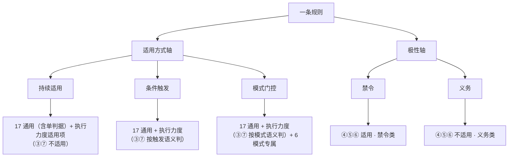

# rule-inspector 知识库：判据体系总览

> **判据权威在 `references/criteria.md`（单源）**——本 README 是体系视图与知识库，记录「双轴模型、类型判定、检查点归属、计分口径、已知坑」，不重复判据全文。类型扩展设计定稿于 spec `2026-10-09-rule-type-scoring-design.md`（实现随 plan 落地）。
> 忘的时候先读这里，再按指针去读 criteria.md / 报告模板 / 该 spec。

## 1. 体系总览图谱

一条规则 = 适用方式 × 极性。评分 = 按类型选检查点，全满足 = 合格。

## 2. 双轴模型（两个正交轴）

### 轴一：适用方式（3 值）——规则怎么被触发/适用

| 值 | 定义 | 特征 |
|---|---|---|
| **持续适用** | 无条件、无触发时机 | 无「在…时/开工时/落地后」类条件与时机词 |
| **条件触发** | 由条件/事件/时机触发一次 | 有明确触发条件（编辑时/开工时/落地后/测试 stuck 时） |
| **模式门控** | 持久的模式状态变量，规则一直在线，按当前模式裁决同一动作 | 含「模式/适用/退出/回到/重新适用」状态转移描述 |

**条件触发 vs 模式门控（核心区别）**：
- 条件触发 = `if(事件E) => 动作A`——一次性，E 不发生则规则不存在（门铃响了开门）。
- 模式门控 = 持久 `state` + 按当前 state 裁决**同一个动作** + 独立的 state 转移（红绿灯：灯色是状态，走不走按灯色，灯色切换是信号系统的事）。

### 轴二：极性（2 值）——要求做还是不做

| 值 | 判定词（封闭词表） |
|---|---|
| **禁令**（不做） | 禁止 / 不得 / 不要 / 严禁 |
| **义务**（做） | 必须 / 应 / 要 / 一律 |

> 「规范」不是极性，是体裁（约定/标准怎么写）；写成「必须做 Y」= 义务，写成「禁止做 Z」= 禁令。
> **极性必须单一 + 主题单一**：一个文件一个核心判据 = 「单判据」（通用检查点，见 §4）。极性混合或多个互不相关的 H2 主题 = 合集 = 该拆。
> **判定词封闭**：极性词一律用表内词（禁：禁止/不得/不要/严禁；义：必须/应/要/一律）；表外词（不允许/不可/切勿…）由 rule-writer 归一成表内词，正文不引入表外判定词（归一细节见 `rule-writer/references/writing-guide.md`）。

### 纠错记录（为什么不是「4 类型」）

曾把「硬禁令/模式门控/事件触发/正向义务」当同一层 4 类——**错**。它们是两轴的跨乘结果（硬禁令 = 持续或条件×禁令，事件触发 = 条件×义务，正向义务 = 任意×义务）。真正新增的第三种**适用方式**只有**模式门控**。以双轴为准。

### 现有 14 条实际盘点（2026-10-09）

| 适用方式 | 规则 |
|---|---|
| 持续适用（5） | no-git-write(禁)、how-i-must-reason(义)、plain-language(义)、docs-convention(义)、skill-assets(义) |
| 条件触发（7） | import-guard(禁)、powershell-encoding(禁)、rules-single-source(禁)、ts-expect-error(禁)、poll-deferred(义)、landing-sweep(义)、vitest-queued(义) |
| 模式门控（1） | **global-ask-before-acting(禁)** |
| 待拆未定（1） | code-style（合集：3 个独立判据 + 混合极性 → 该拆，单判据=0 样板） |

## 3. 类型判定流程（AI 判，脚本只接收）

- **判定责任**：AI 在体检流程判类型，作为 `opts.type` 传给 score.mjs（同 triCheckDone 模式）。脚本不做类型归类，只按类型选检查点机械算分。确定性保持。
- **合集文件（单判据=0）的类型视为「待拆未定」**——拆完按各新文件分别判。评分：只报通用组（满分 17，单判据=0）+ 处方该拆，执行力度/类型专属不评，**不报整体级别**（拆后按各新文件重评）。
- **判定顺序**：先看模式门控 → 再看条件触发 → 否则持续适用。

| 判定为 | 线索 |
|---|---|
| 模式门控 | 含「模式/适用/退出/回到/重新适用」状态转移描述，或按「某条消息/某状态」裁决同一动作 |
| 条件触发 | 含「开工时/落地后/编辑时/…时/…后/…前」时机或条件标记 |
| 持续适用 | 以上皆无，无条件持续适用 |

| 极性 | 线索 |
|---|---|
| 禁令 | 含「禁止/不得/不要/严禁」 |
| 义务 | 含「必须/应/要/一律」且无禁令词 |
| 混合（缺陷） | 既有禁令词又有义务词且无单一核心判据 → 单判据判 0（该拆） |

## 4. checkpoint 归属表（类型视角）

**通用 17 项**（所有类型共用）：头部规范 3 + 层级规范 2 + 来源精简 2 + 引用完整 1 + 冗余度 4 + 标题 4 + **单判据 1**。

**单判据（通用结构检查点，AI 判，每项 1 分）**：一个文件只承载一个核心判据（一个极性 + 一个主题）；多个互不相关的 H2 主题 / 极性混合且无单一核心判据 = 合集 = 该拆（判 0 + 处方「拆成 N 条独立规则」）。**评分单元保持按文件**，不按节评分。「一个判据的部件」（如 no-git-write 的禁止写/允许读/遇到不确定暂停）不算多判据。code-style 为合集样板。

**执行力度适用项 + 满分口径**：

| 类型 | 极性 | 执行力度适用项 | ③⑦ 口径 | 执行力度组 max | 满分（+17 通用） |
|---|---|---|---|---|---|
| 持续适用 | 禁令 | ①②④⑤⑥⑧ | — | 6 | 23 |
| 持续适用 | 义务 | ①②⑧ | — | 3 | 20 |
| 条件触发 | 禁令 | ①②③④⑤⑥⑦⑧ | ③=触发条件明确；⑦=可观测时机 | 8 | 25 |
| 条件触发 | 义务 | ①②③⑦⑧ | 同上 | 5 | 22 |
| 模式门控 | 禁令 | ①②③④⑤⑥⑦⑧ + M1–M6 | ③=模式归属可判定；⑦=切换信号可观测 | 14 | 31 |
| 模式门控 | 义务 | ①②③⑦⑧ + M1–M6 | 同上 | 11 | 28 |

④⑤⑥ 仅禁令类适用。**不适用项不计入满分**。

**模式门控 6 个专属检查点（AI 判，每项 1 分）**：

| # | 检查点 | 查什么 |
|---|---|---|
| M1 | 状态集合完整 | 定义全部模式（≥2 态），漏一态 = 该态没交代 |
| M2 | 每状态行为明确 | 每态有动作裁决，空态 = 0 |
| M3 | 切换判据明确 | 状态转移由可观测信号驱动，无「感觉/大概」 |
| M4 | 回到逻辑完整 | 有「退出→重新适用」回转，单向退出 = 规则失效 |
| M5 | 模式边界封闭 | 每态覆盖情形可判定/枚举，不用语义归类（防掠过） |
| M6 | 退出后由谁接管 | 让位时指明按什么管，退出不留空档 |

## 5. checkpoint 反查表（检查点视角）

| 检查点 | 适用类型 |
|---|---|
| 通用 17（头部/层级/来源/引用/冗余/标题/单判据） | 所有类型 |
| 执行力度 ①②⑧（极性/动作/验证） | 所有类型 |
| 执行力度 ③（适用条件） | 条件触发、模式门控（持续适用不适用） |
| 执行力度 ⑦（触发机制） | 条件触发、模式门控（持续适用不适用） |
| 执行力度 ④⑤⑥（来源覆盖/冲突裁决/例外从严） | 仅禁令类（三种适用方式均可） |
| 模式专属 M1–M6 | 仅模式门控 |

## 6. 计分与级别

- 每检查点 1 分；满分 = 该类型适用检查点数（见 §4）；得分率 = 得分 ÷ 满分。
- 级别：健康 ≥90% / 预警 70–89% / 不及格 <70%。
- **分数 = 缺口指示器**（这种类型还差哪几个检查点），**不是横向质量排名**。
- **只同类型比较，跨类型不比**（不同类型满分不同是设计使然）。全满足 = 合格。

## 7. 脚本边界与硬闸门

**脚本边界（越界原则）**：
- 脚本只做**机械可复算**的判断（数行数、查来源行、匹配关键词、按 type 选检查点算分）。
- **不判语义**：类型判定、单判据、三检验 #1#2、M1–M6 都是 AI 判，脚本不碰。
- **不删不改**：脚本输出不含「判据」「建议删除」（标题「判据式非主题名」以安全别名发出）——分数是体检不是验收，不给删除建议。
- 确定性：同输入必同输出；不引 LLM、不联网、不随机。

**硬闸门（6 条，见 SKILL.md）**：
1. 禁止删除行为边界规则的判据句
2. 禁止改动判据措辞（报告改前改后 + 等确认）
3. 禁止为凑分数改规则（分数是体检不是验收，不及格不要求砍到线下）
4. 禁止把语义判断交给脚本
5. 删冗余必须写出三检验过程
6. 标题一致性检查是收尾必做

## 8. 已知代理假阴性清单（机械分打低但语义在）

机械代理认死措辞，以下语言会被误判为缺失，**读分数前先对照**：

| 假阴性形态 | 例子 | 处理 |
|---|---|---|
| 模式门控语言 | 「这条消息是不是用户主动发起的对话」控制（触发）；「只适用于…的时刻」（条件）；「唯一豁免：只读探查」封闭清单（例外） | 类型判为模式门控后，③⑦ 按模式语义判，M1–M6 兜底 |
| 极性词等价 | 标题「不得」↔ 正文「禁止/不擅自」（语义等价、逐字不匹配） | 判定词归一后新规则不再产生；旧规则优化时归一 |
| 裸「…中」前提 | 标题「沟通中」——代理前提标记集只认「在…中/除非/仅限」 | 已知 |
| 「只有…时」vs「只有…才算」 | 例外措辞变体 | 已知 |
| 无来源行时「来源精简」组 2/2 | 无来源行只清零头部规范组（spec 字面） | 已知，spec 字面忠实 |

> 全量判据与判定列以 `references/criteria.md` 为准；体检报告模板见 `assets/rule-report-template.md`；类型扩展设计见 `docs/superpowers/specs/2026-10-09-rule-type-scoring-design.md`。
